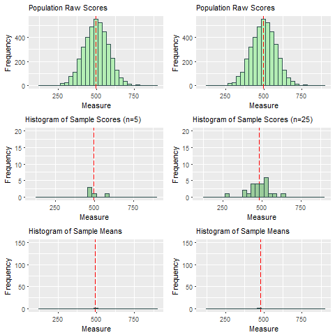
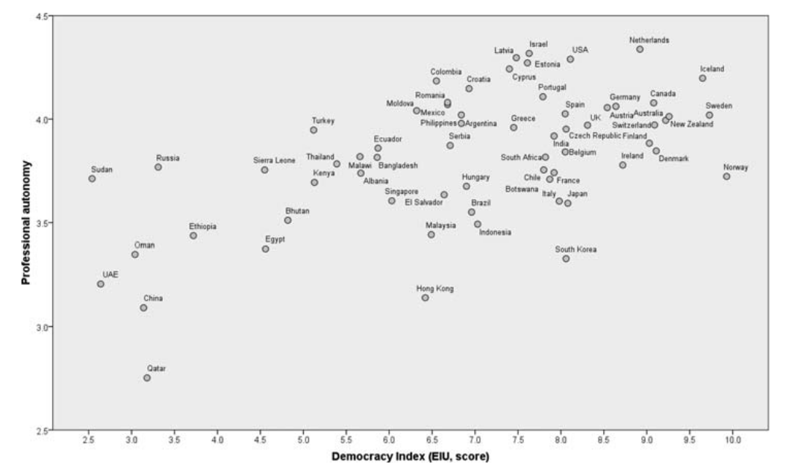
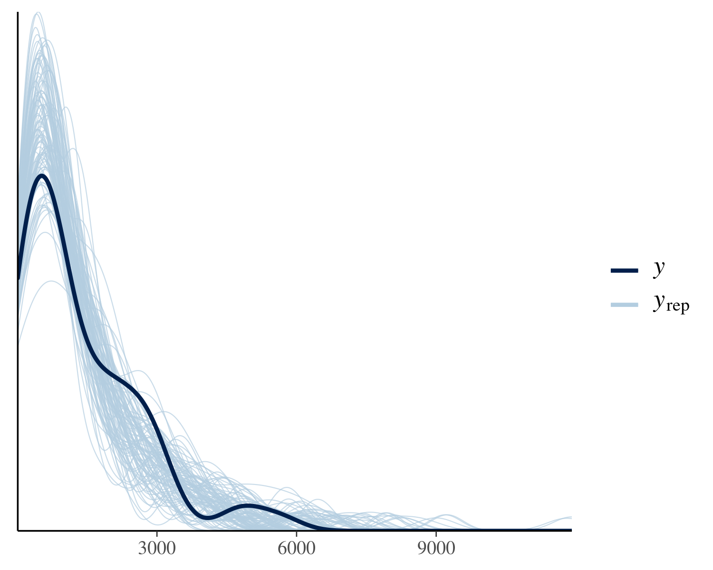
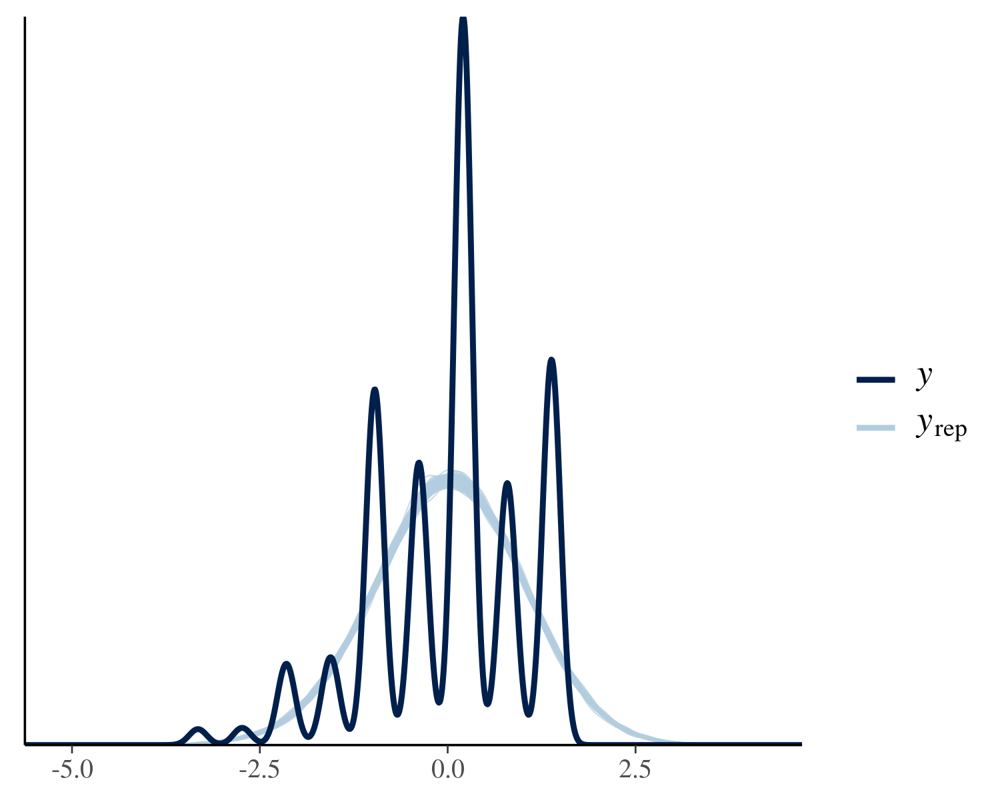
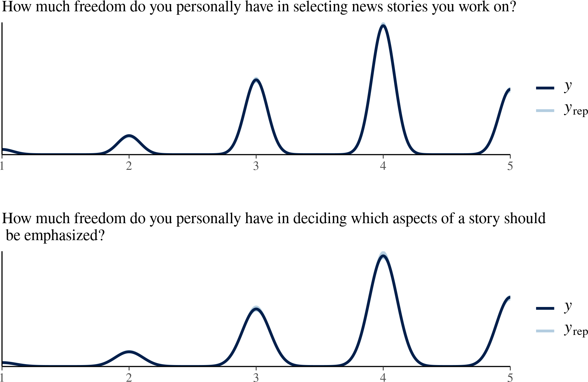

```{r xaringanExtra, echo = FALSE}
xaringanExtra::use_tile_view()
xaringanExtra::use_animate_all(params$animation)
mzesalike::use_footer(params)
```

.extralarge["The comparative approach attempts to reach conclusions beyond single cases and explains differences and similarities between objects of analysis against the backdrop of their contextual conditions."]

[Esser (2014)](http://dx.doi.org/10.1057/9781137366474_2)

---

# Raison d'être

.extralarge[
* Non-atomicity
* Non-stochasticity
]

---

# Non-atomicity 1

* An article nested in a media outlet nested in a **country** nested in a media system

* A journalist nested in a media outlet nested in a **country** nested in a media system

---

# Non-atomicity 2

**Solution:** Multilevel modeling (R packages: lme4, nlme, glmmTMB)

**Example:** Worlds of Journalism **survey**

**Personal-level:**

DV: Perceived Professional Autonomy, IV: Experience

**Country-level:**

IV: eiu: democracy performance

```r
lmer4(ppa ~ EXPRNCE + I(eiu^3) + (1|COUNTRY), data = wjs)
```

---

# Non-atomicity 3

**Example:** useNews dataset (a complete corpus of news articles; a **census**)

**Outlet-level:**

1. china: Total number of articles about China
1. n: total number of articles

**Country-level:**

1. trade: trade volume with China

```r
glmer.nb(china ~ offset(log(n)) + (1|country) + 
log(trade), data = outlet_data)
```

Does it work the same?

---
class: hide-footer

# Non-stochasticity

.pull-left[
```{r, fig.width = 35, echo = FALSE}

```
.extrasmall[Source: Brenda Anderson (Stony Brook)]

]

.pull-right[
Census data is non-stochastic (no randomization is involved). 

Frequentist inference does not apply.

]

---

# Our solution: Bayesian inference

.pull-left[
$$P(\theta | X) \propto  P(\theta) P(X| \theta)$$
]

.pull-right[

**Goal:** $P(\theta | X)$

Our certainty on how likely the estimand $\theta$ is, given the current available data

**Receipe**

1. X (data)
2. A method to derive $P(X| \theta)$ (MCMC, provided by brms)
3. $P(\theta)$ **Prior**

.extrasmall[Bürkner, P.-C. (2017). brms: An R Package for Bayesian Multilevel Models Using Stan. Journal of Statistical Software, 80(1), 1–28.]

]

---

# Prior

.large[
1. 1/7 of communication papers are replication
2. Expert elicitation
3. Weakly informative prior
]

.extrasmall[Keating, D. M., & Totzkay, D. (2019). We do publish (conceptual) replications (sometimes): Publication trends in communication science, 2007–2016. Annals of the International Communication Association, 43(3), 225-239.]

---

# It's almost the same as lme4

```r
weaklyinformative_prior <- 
c(prior_string("normal(0, 1)", class = "b"),
  prior_string("normal(0, 1)",class = "Intercept"))

import_brms <- brm(china~offset(log(n))+(1|country)+
log(trade),
          data = outlet_data, 
		  family = negbinomial(),
          prior = weaklyinformative_prior, 
		  sample_prior = TRUE)
```

---

# Inference at the correct level

.pull-left[
```{r, fig.width = 30, echo = FALSE}

```

.extrasmall[Hamada, B. I. (2021). Determinants of Journalists’ Autonomy and Safety: Evidence from the Worlds of Journalism Study. Journalism Practice, 1–21. doi:10.1080/17512786.2021.1871861]

]

.pull-right[
```{r fig5, echo = FALSE, message = FALSE}
require(ggplot2)
x <- readRDS("~/dev/usenews_bayes/qmod_condit.RDS")
x$`eiu` + xlab("Index of Democracy (mean-centered)") + ylab("Perceived professional autonomy (mean-centered)") + theme_minimal() + scale_color_brewer(palette = "Dark2") + scale_fill_brewer(palette = "Dark2")
```

]

---
class: hide-footer

# Model checking through data generation (Posterior predictive checks)

.pull-left[
```{r, fig.width = 30, echo = FALSE}

```
]


.pull-right[
```{r, fig.width = 30, echo = FALSE}

```
]

---
class: hide-footer

```{r, fig.width = 30, echo = FALSE}

```

---
# Contributions

* The Raison d'être of Bayesian analysis for comparative communication research
    * Non-atomicity (Nested data structure)
    * Non-stochasticity (No randomization)
* Recipe
    * Data
	* Likelihood function (brms, very similar to lme4)
	* Prior (can use weakly informative priors)
* Advantages
    * Valid inference
	
