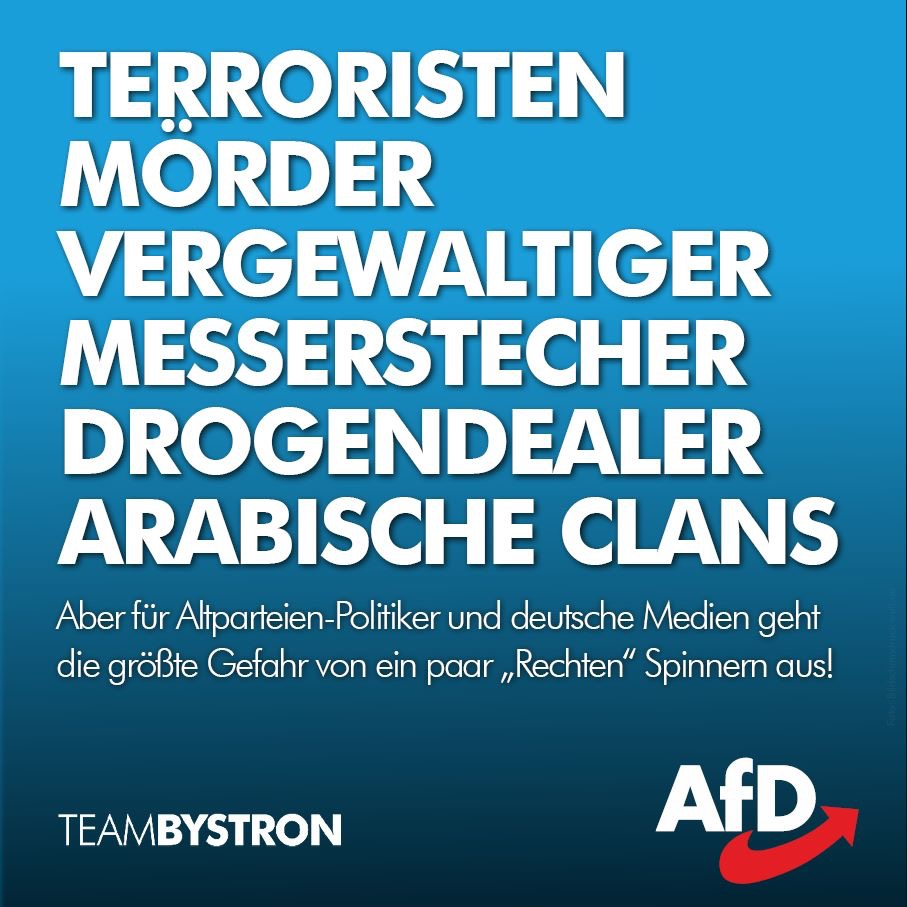
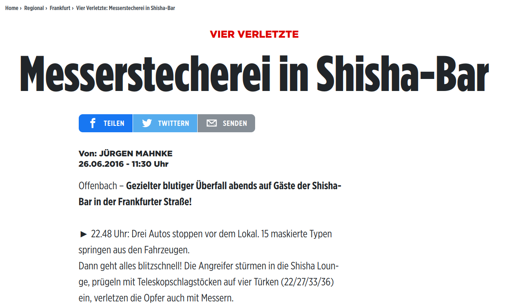
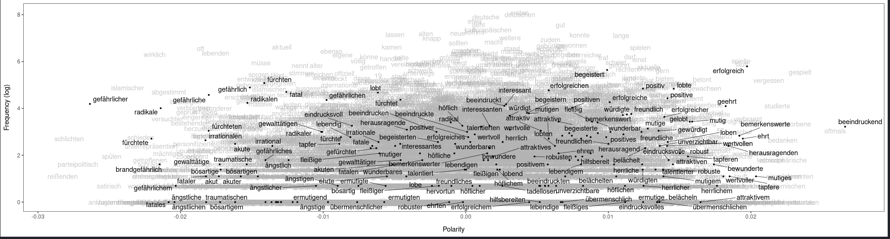
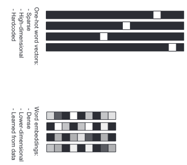
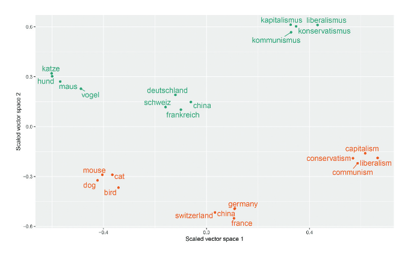
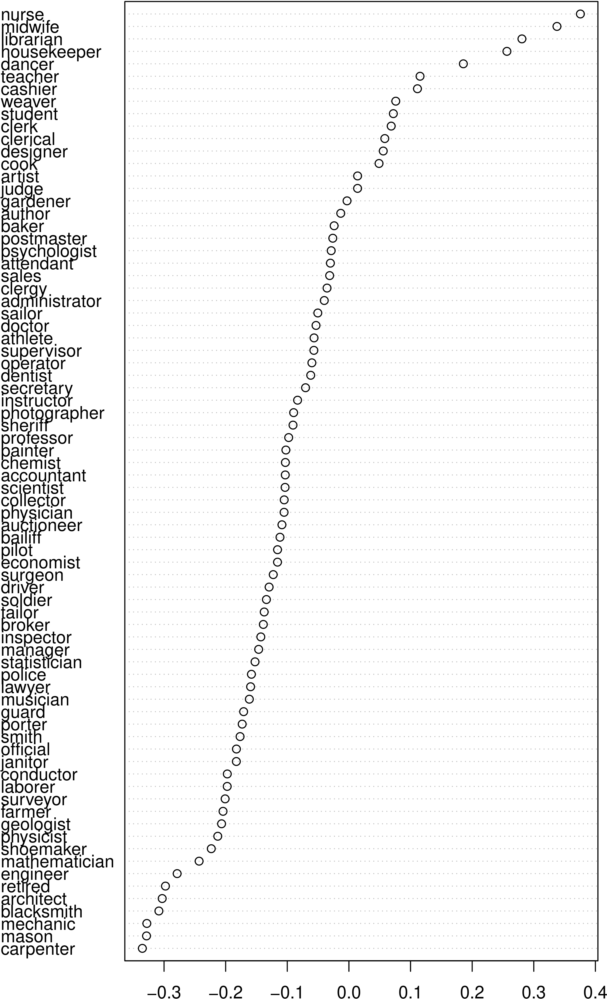
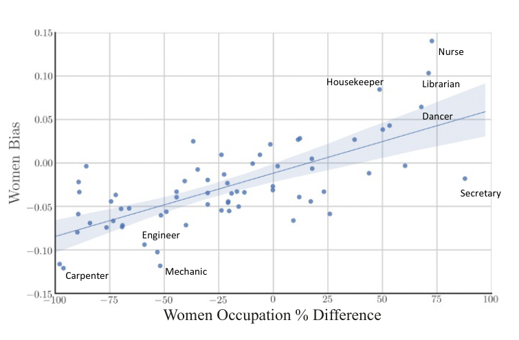

```{r xaringanExtra, echo = FALSE}
xaringanExtra::use_tile_view()
xaringanExtra::use_animate_all(params$animation)
xaringanExtra::use_logo(image_url = "img/mzes_logo.png", width = 280)
mzesalike::use_footer(params)
```

# Empowerment Statements

After this presentation, you will know

* The difference between **Explicit** and **Implicit Stigmatization**
* Methods to measure them using Semi-Supervised Machine Learning
* Unresolved problems associated with these methods

---

# Objectives

* Distinguish Explicit and Implicit Stigmatization of Ethnic ~~and Religious~~ Groups in Journalistic Discourse
   * *Bild, die tageszeitung (taz), Der Spiegel, Die Welt, Die Zeit, Frankfurter Allgemeine Zeitung (FAZ), FOCUS, Süddeutsche Zeitung (SZ), Tagesspiegel,* and *T-Online*
   * 2017-04-10 to 2018-04-10, 697,913 articles
* Study country-level factors associated with Explicit and Implicit Stigmatization

---

# Implicit Social Cognition Model of Media Priming (Arendt, 2013)

* .extralarge[**Implicit Stigmatization**] - .large[Strength of the automatic association between a group concept and a negative attribute]

* .extralarge[**Explicit Stigmatization**] - .large[Validation of automatically activated negative associations]


.extrasmall[Arendt (2013) 
Dose-Dependent Media Priming Effects of Stereotypic Newspaper Articles on Implicit and Explicit Stereotypes. Journal of Communication.]

---

# Example of Explicit Stigmatization

.pull-left[

]

.pull-right[
* Positional statements

"When Mexico sends its people, they’re not sending their best. They’re not sending you. They’re not sending you. They’re sending people that have lots of problems, and they’re bringing those problems with us. They’re bringing drugs. They’re bringing crime. They’re rapists. And some, I assume, are good people."

]

---

# Example of Implicit Stigmatization

.pull-left[
<iframe width="560" height="315" src="https://www.youtube.com/embed/4SuoRTpkyq0" title="YouTube video player" frameborder="0" allow="accelerometer; autoplay; clipboard-write; encrypted-media; gyroscope; picture-in-picture" allowfullscreen></iframe>
]

--

.pull-right[

(Automatic) Associational statements.


Die Welt der Suzie Wong (1960)

]
---

# Question

.pull-left[
**Doc 1:** Die Leute, die häufig in der Shisha-Bar rauchen, sind kriminell. 

**Doc 2:** *Adam* raucht häufig in der Shisha-Bar.

**Doc 3:** *Ben* ist kriminell.
]

.pull-right[

]

---

# Explicit stigmatization: operationalization

*Ben* ist **kriminell**.

* Positional statement: Textual sentiment associated with a group name
* Ingredients: 
1. group names
2. sentiment words

---

# Implicit stigmatization: operationalization

Die Leute, die häufig in der Shisha-Bar rauchen, sind **kriminell**. 

*Adam* raucht häufig in der Shisha-Bar.

* Associational statement(s): Textual sentiment associated with the contexts in which a group name is used
* Ingredients:
1. group names
2. sentiment words
3. contextual understanding of where a word is used

---

# Ingredient 1: Group names

30 groups in *Mikrozensus* (2018)

All grammtical forms of a demonym (noun)

e.g. *Niederländer, Niederländers, Niederländern, Niederländerin, Niederländerinnen*

*Brite, Briten, Britin, Britinnen, Engländer, Engländers, Engländern, Engländerin, Engländerinnen,
Waliser, Walisers, Walisern, Waliserin, Waliserinnen, Schotte, Schotten, Schottin, Schottinnen,
Nordirländer, Nordirländers, Nordirländern, Nordirländerin, Nordirländerinnen*


`r fontawesome::fa("github")` [chainsawriot/dewi](https://github.com/chainsawriot/dewi)

---

# Ingredient 2: Sentiment words I

Data-driven seed dictionaries of adjectives related to fear $\mathcal{F}$ and admiration $\mathcal{A}$ (Haselmayer & Jenny, 2017)

Extracted from a handcoded collection of 3,000 sentences containing at least one group name.

- "Training" with 1,500 sentences / validate with the rest of 1,500 sentences

.extrasmall[Haselmayer, Jenny (2017). Sentiment analysis of political communication: combining a dictionary approach with crowdcoding. Quality & Quantity]

---

# Ingredient 2: Sentiment words II

**Fear:** *fürchten, gefährlich, fatal, radikale, radikal, irrational, gewalttätig, akut, brandgefährlichen, bösartige, radikaler, traumatisch, ängstigen,
ängstlich*

**Admiration:** *würdigen, loben, mutig, beeindrucken, wunderbar, fleißig, geehrt, attraktive, belächeln, bemerkenswerte, eindrucksvoll, ermutigend, herausragende, hervorgetan, lebendig, robust, tadellos, talentiert, tapfer, wunderbare, übermenschlich, erfolgreich, positiv, beeindruckend, bewundern, freundliche, hilfsbereit, höflich, interessant, wertvoll, attraktiv, begeistern, herrlich, unverzichtbar*

All grammatical forms and comparative forms.

`r fontawesome::fa("github")` [chainsawriot/verbformen](https://github.com/chainsawriot/verbformen)

---
class: hide-footer

# Operationalization I



**Explicit stigmatization**: Semi-supervised scaling using Latent Semantic Scaling (Watanabe, 2020) of sentences containing a group name $g$ with respect to the seed dictionaries $\mathcal{A}$ and $\mathcal{F}$.

`r fontawesome::fa("github")` [koheiw/LSX](https://github.com/koheiw/LSX)

.extrasmall[Watanabe (2020) Latent Semantic Scaling: A Semisupervised Text Analysis Technique for New Domains and Languages. Communication Methods & Measures]

---

# Ingredient 3: Contextual understanding

**Distributional semantics**: words that are used and occur in the same contexts tend to purport similar meanings

**Doc 1**: Berlin ist die Hauptstadt von *Deutschland*

**Doc 2**: Paris ist die Hauptstadt von *Frankreich*

**Doc 3**: Tokio ist die Hauptstadt von *Japan*

**Doc 4**: Die *Katze* zählt zu den beliebtesten Heimtieren.

*Deutschland, Frankreich*, and *Japan* (but not *Katze*) should have similar meanings because they are used in the similar contexts

---

# Quantification of distributional semantic meanings of words I

.pull-left[



.extrasmall[Credit: Chollet. Deep Learning with Python]

]

.pull-right[
**Word embeddings**: word vectors capturing the distributional semantic meanings of words in a large corpus of textual content.

The input word embedding $w$ is a dense $m\times n$ matrix, where $m$ is the total size of the vocabulary in the training corpus and $n$ is the vector dimension size. Let $v_x$ denote a row vector of $w$, the word vector of the word $x$.
]
---

# Quantification of distributional semantic meanings of words II

.pull-left[

.extrasmall[Chan et al. (2020)  Reproducible Extraction of Cross-lingual Topics (rectr). Communication Methods and Measures]
]

.pull-right[
**Semantic similarity**: The distance (e.g. cosine distance) between $v_{deutschland}$ and $v_{frankreich}$ should be shorter than $v_{deutschland}$ and $v_{katze}$.
]

---

# Quantification of distributional semantic meanings of words III

.pull-left[

]

.pull-right[
**Word Embedding bias**: Differential association of a word with two sets of attributes in the word embedding spaces.

$\mathcal{A} = \{she, daughter, hers, ...\}$.
$\mathcal{B} = \{he, son, his, him, ...\}$

]

---

# Quantification of distributional semantic meanings of words IV

Normalized Association Score (Caliskan et al., 2017) of a group name $g$:

Let $cos(v_1, v_2)$ denote the cosine of the angle between vectors $v_1$ and $v_2$.

$NAS(g, \mathcal{A}, \mathcal{F}) = \frac{mean_{a \in \mathcal{A}} cos (v_g, v_a) - mean_{f \in \mathcal{F}} cos (v_g, v_f) }{sd_{x \in \mathcal{A} \cup \mathcal{F}} cos(v_g, v_x)}$

`r fontawesome::fa("github")` [chainsawriot/sweater](https://github.com/chainsawriot/sweater)

.extrasmall[Caliskan et al. (2017) Semantics derived automatically from language corpora contain human-like biases. Science]

---

# Operationalization II

**Implicit stigmatization**: $NAS(g, \mathcal{A}, \mathcal{F})$ based on GLoVE word vectors (Pennington et al., 2014) locally trained on the corpus of 697,913 news articles

`r fontawesome::fa("github")` [rexyai/rsparse](https://github.com/rexyai/rsparse)

.extrasmall[Pennington et al. (2014) GloVe: Global Vectors for Word Representation]

---
background-image: url(ra7.png)
background-position: center
background-size: cover
class: hide-logo, center, bottom, hide-footer

---
background-image: url(ra8.png)
background-position: center
background-size: cover
class: hide-logo, center, bottom, hide-footer

---

# Explaining the differences (Preregistered)

Dependent variables: Implicit / Explicit 

Independent variables

1. GDP per Capita
2. Group Size in Germany
3. Group size in Germany (Forced migration)
4. Cultural distance with Germany (WVS)
5. Muslim population

Bayesian multilevel modeling (`r fontawesome::fa("github")` [paul-buerkner/brms](https://github.com/paul-buerkner/brms))

---

# Bayesian models

```{r, echo = FALSE}
library(knitr)
x <- data.frame(Variable = c("Log GDP", "Log Group Size", "Log Group Size (F)", "Log Distance", "Log Muslim"), Explicit = c(15.4, 20.6, 85.7, 17.6, 59.4), Implicit = c(4.8, 64.5, 50.0, 11.7, 24.6))
kable(x, caption = "% of HDI in Region of Practical Eqivalence (Bayesian Models)", format = 'html')
```


---
class: inverse, middle, center

# Unresolved problems

---

# Explicit stigmatimization and communication of responsibility (Smith 2007)

"Im Verfahren gegen zwei Brüder der **ermordeten** Deutsch-Türkin Hatun Sürücü wird in Istanbul heute ein Urteil erwartet"

Does this sentence reinforce a certain stigma of female German-Turks?

---

# Foreigners in other countries versus Foreigners in Germany

"Das Halbfinal-Hinspiel der Champions League gewinnt Real Madrid durch drei Tore des **Portugiesen** gegen Stadt-Rivale Atlético mit 3:0."

"Für Bayer machte der **Grieche** zuvor in 51 Partien fünf Treffer."

---

# Validity of Implicit measurement

.pull-left[

.extrasmall[Garg et al. (2017) Word embeddings quantify 100 years of gender and ethnic stereotypes. PNAS]
]

.pull-right[
* Corpus-based measurement, manual validation not possible
* Previous attempts: scientific instrumentalism
]


---

# New MZES research group in April

.large[Impliziter und expliziter Rassismus in Nachrichtenmedien und sozialen Medien: Ausmaß und Wirkung]

.small[Forschungsverbund „Diskriminierung und Rassismus“ (FoDiRa)]

.small[Bundesministerium für Familie, Senioren, Frauen und Jugend]

*PIs*: Philipp Müller, Chung-hong Chan, Hartmut Wessler

*Postdoc*: Rainer Freudenthaler

*PhD candidate*: Katharina Ludwig

---

# Contributions

* The difference between **Explicit** and **Implicit Stigmatization**
   * Positional statements and associational statements
* Methods to measure them using Semi-Supervised Machine Learning
   * Latent Semantic Scaling, Word Embedding bias
   * `r fontawesome::fa("github")` [chainsawriot/sweater](https://github.com/chainsawriot/sweater)
* Unresolved problems associated with these methods
   * Communication of responsibility
   * Foreigners in other countries vs Foreigners in Germany
   * Validity of implicit measure and scientific instrumentalism

`r fontawesome::fa("question")`
